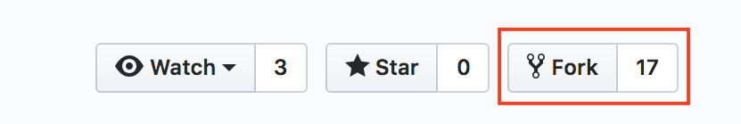
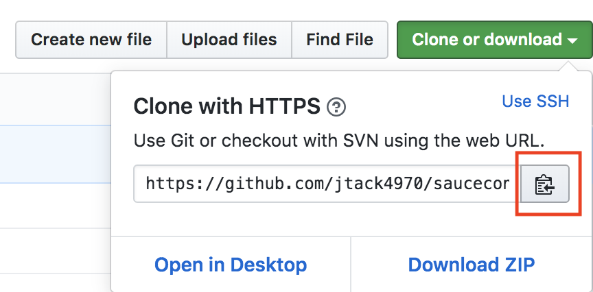
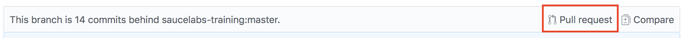
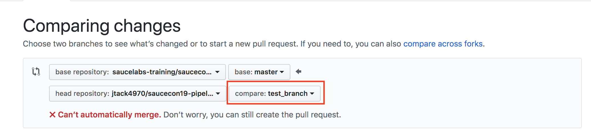
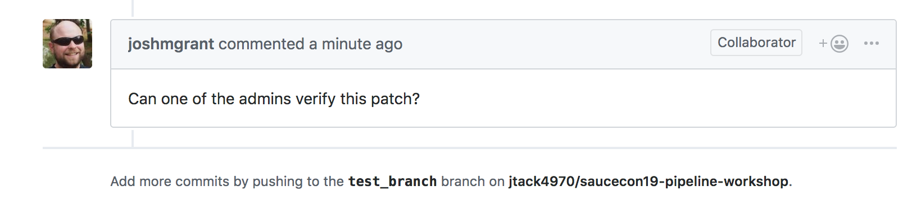
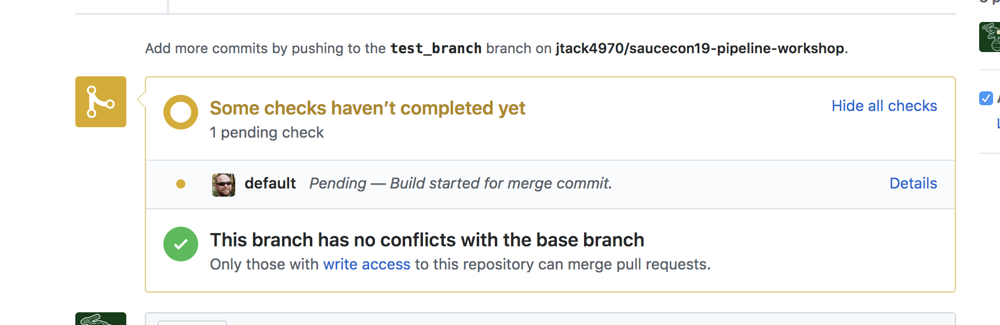
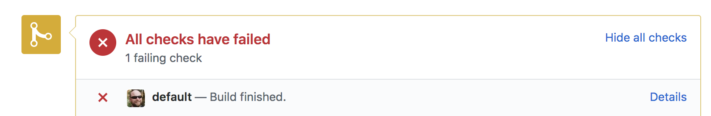

# Creating a Continuous Delivery Pipeline with Automated Testing Exercises
## Prerequisites

Before you begin, consult the parent [README](../README.md) for instructions on how to complete the following:

* [Install Git](../README.md#install-git)
* [Install NPM / NodeJS](../README.md#install-npm-and-nodejs)
* [Install and IDE](../README.md#install-an-ide)
* [Install WebDriverIO](../README.md#install-webdriverio)

Download the latest [release](https://github.com/saucelabs-training/saucecon19-pipeline-workshop/releases) archive and import the project into your local environment and begin experimenting with creating your own automated Selenium tests!

## Setup the Project

#### 1. **Fork the Project Repository**:
First we need to create a one to one copy of the base repository

* Login to your GitHub account
* Navigate to [sauce-training/saucecon19-pipeline-workshop](https://github.com/saucelabs-training/saucecon19-pipeline-workshop)
* Click the **Fork** button:
        

    
* After the Fork completes, navigate to your GitHub account profile and open the new forked repo.

#### 2. **Clone the Project Directory**:
* Create a directory on your filesystem to store the project files.
* Copy the forked GitHub repo URL like so:
    

    
* `git clone` the repository onto your local filesystem. For example:
    
```
$ git clone https://github.com/<your-github-username>/saucecon19-pipeline-workshop.git
```
#### 3. **Update Dependencies**:
* Import the root project directory in your editor/IDE of choice:
* [Open a terminal from the project root directory](https://macpaw.com/how-to/use-terminal-on-mac) (or a [command prompt](https://www.lifewire.com/how-to-open-command-prompt-2618089) for Windows users) and run the following command:
```
$ npm install
```
    > You may run into NPM errors if you have an older version of WebDriverIO installed, please update to the latest version.
    
#### 4. **Create a Test Pull Request**:
* In the root project directory, add the following method to the **`Calculator`** class in **`src/app.js`**:
    
```
testAlert() {
    this.toString("this is a test alert message for PRs");
}
```
    
* **`git checkout`** a new test branch:
    
```
$ git checkout -b <your-github-username>-test-branch
```
* **`commit`** your changes and **`push`** to the remote
```
$ git add -A
$ git commit -m "<your-github-username> test PR"
$ git push origin <your-github-username>-test-branch
```
    
* Navigate to your GitHub Account profile and open a new Pull Request:
* Click this link:

        
* Ensure that you're opening the PR against the base branch ([saucecon19-pipeline-workshop](https://github.com/saucelabs-training/saucecon19-pipeline-workshop)):

        
* Add a comment if necessary and click **Submit**
* You should see the following messages appear in order on your current PR
    * Automated Message from Jenkins Admin:
    
        
    * Notification that Jenkins Job is Running:
    
        
    * Notification that Automated Tests Failed (this is expected) and merge is denied:
    

## Exercise List
1. [Beginner Challenge](exercise1.md)
2. [Intermediate Challenge](exercise2.md)
3. [Advanced Challenge](exercise3.md)

> ##### Disclaimer: For Demonstration Purposes Only
> The code provided in the exercise scripts is provided on an "AS-IS” basis without warranty of any kind, either express or implied, including without limitation any implied warranties of condition, uninterrupted use, merchantability, fitness for a particular purpose, or non-infringement. These scripts are provided for educational and demonstration purposes only, and should not be used in production. Issues regarding these scripts should be submitted through GitHub. These scripts are maintained by the Technical Services and Info Development teams at Sauce Labs.

    